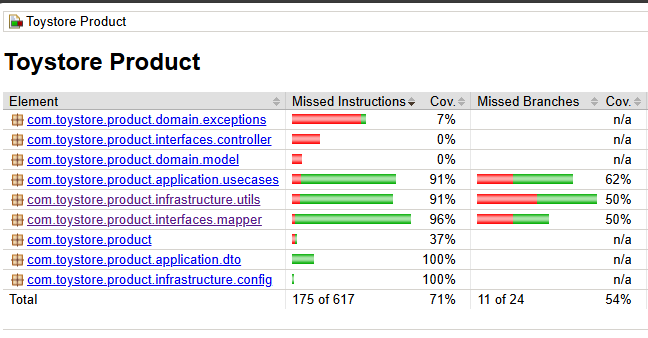

# Toystore Product

Gerenciamento de produtos para a loja de brinquedos.

## 🚀 Executando o projeto localmente

### 1. Criar imagem Docker do projeto

```sh
docker build -t toy-store-product .
```

### 2. Criar uma rede Docker

```sh
docker network create toystorerede
```

### 3. Visualizar a rede recém-criada

```sh
docker network ls
```

### 4. Verificar o que está rodando na rede

```sh
docker network inspect toystorerede
```

### 5. Executar a imagem Docker localmente

```sh
docker run -p 8080:8080 toy-store-product --network toystorerede
```

### 6. (Opcional) Executar Postgres localmente

```sh
docker run --name postgres-toy-store -e POSTGRES_USER=postgres -e POSTGRES_PASSWORD=postgres -e POSTGRES_DB=postgres -p 5432:5432 --network toystorerede -d postgres
```

### 7. Taguear imagem

```sh
docker tag toy-store-product:latest fakynno/toy-store-product:1.0
```

### 8. Fazer deploy no Docker Hub

```sh
docker push fakynno/toy-store-product:1.0
```

### Acesse o Swagger: http://localhost:8080/swagger-ui.html

## 📊 Cobertura de Testes - JaCoCo
</img>

## 🛠️ Tecnologias Utilizadas

- Java 17
- Spring Boot
- Spring Data JPA
- Spring Web
